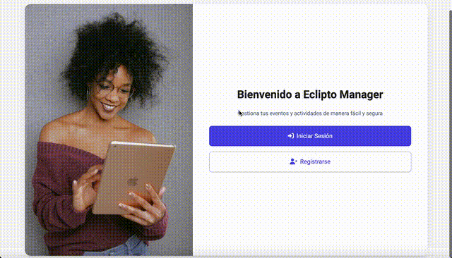

<div align="center">
  <h1>🎫 Eclipto Manager</h1>
  <p>Sistema de gestión de eventos y venta de tickets</p>
</div>

<div align="center">
  
  
  
</div>

## 📋 Descripción

Eclipto Manager es una aplicación web moderna para la gestión de eventos y venta de tickets. Permite a los organizadores crear y administrar eventos, mientras que los usuarios pueden comprar tickets de forma segura y sencilla.

## ✨ Características principales

- 🔐 Autenticación con JWT y Google Sign-In
- 👥 Roles de usuario (Admin/Usuario)
- 📅 Gestión completa de eventos
- 🎟️ Sistema de venta de tickets
- 📊 Panel de administración
- 📱 Diseño responsive

## 🛠️ Tecnologías utilizadas

### Frontend
- Angular 18
- TypeScript
- Bootstrap
- NgRx para gestión de estado
- Angular Material
- JWT para autenticación

### Backend
- Spring Boot 3
- Java 17
- Spring Security
- PostgreSQL
- Hibernate
- Maven

## 🏗️ Arquitectura

### Frontend
La aplicación está construida siguiendo el patrón de arquitectura por módulos de Angular:
- Core: Servicios singleton, guardias y modelos
- Shared: Componentes reutilizables
- Features: Módulos funcionales (auth, admin, user)

### Backend
Implementa una arquitectura en capas:
- Controllers: API REST
- Services: Lógica de negocio
- Repositories: Acceso a datos
- Security: Configuración de seguridad y JWT

## 🚀 Instalación

### Prerrequisitos
- Node.js (v18+)
- Java JDK 17
- PostgreSQL
- Maven

### Pasos para ejecutar el frontend

```bash
# Clonar el repositorio
git clone https://github.com/tu-usuario/eclipto-manager.git

# Instalar dependencias
cd eclipto-manager/frontend
npm install

# Iniciar servidor de desarrollo
ng serve
```

### Pasos para ejecutar el backend

```bash
# Navegar al directorio del backend
cd eclipto-manager/backend

# Compilar el proyecto
mvn clean install

# Ejecutar la aplicación
mvn spring-boot:run
```

## 🔧 Configuración

1. Crear base de datos PostgreSQL
2. Configurar variables de entorno:
   - `DATABASE_URL`
   - `JWT_SECRET`
   - `GOOGLE_CLIENT_ID`

## 📝 Variables de entorno

Crear archivo `.env` en la raíz del proyecto:

```env
DATABASE_URL=postgresql://localhost:5432/eclipto
JWT_SECRET=tu_secret_key
GOOGLE_CLIENT_ID=tu_google_client_id
```

## 🤝 Contribuir

1. Fork del repositorio
2. Crear rama feature (`git checkout -b feature/AmazingFeature`)
3. Commit cambios (`git commit -m 'Add AmazingFeature'`)
4. Push a la rama (`git push origin feature/AmazingFeature`)
5. Abrir Pull Request

## 📄 Licencia

Distribuido bajo la licencia MIT. Ver `LICENSE` para más información.

<div align="center">
  <p>Desarrollado con ❤️ por <a href="https://github.com/tu-usuario">Tu Nombre</a></p>
</div>
